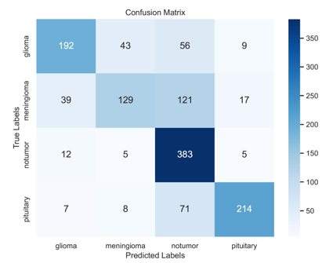

# Brain Tumor Classification

According to American Association of Neurological Surgeons, brain tumor is an abnormal mass of tissue in which ceels grow and multiply uncontrollably, seemlingly unchecked by the mechanisms that control normal cells. A major challenge for brain tumor detection arises from the variations in tumor location, size, shape, and the imaging quality of MRI. 
In this project, we aim to distinguish 3 different brain tumor types: glioma(malignant), pituitary and meningioma (both benign), and no tumor.  

## Table Of Content

- [Dataset](#dataset)


- [Preprocessing](#preprocessing)
  - [Masking](#masking)
  - [Data Augmentation](#data-augmentation)
- [Model](#model)
  - [CNN models](#cnn-models)
  - [Fine-tuning models](#fine-tuning-models)
- [Training](#training)
- [Evaluation](#evaluation)
- [Prediction](#prediction)


## Dataset

The Brain Tumor MRI Dataset is a collection of 7,023 human brain MRI images, which are categorized into Glioma, Meningioma, No tumor, and Pituitary. This dataset is available on Kaggle and has been provided by MASOUD NICKPARVAR. [View the dataset here](https://www.kaggle.com/datasets/masoudnickparvar/brain-tumor-mri-dataset)


## Preprocessing

### Masking

Run the following script:

    ```
    python preprosessing.py --masking 1
    ```

This command will take the data under data/Training and data/Testing as original data and apply some blurring, masking, cropping and resizing to the images and store the resulting images in the generated folders look like Processed_* or Unmasked_Processed_* depending if masking is used. 

--masking would specify is masking is used. If set to True, a kapur thresholding method will be applied on the images and mask the umimport parts.

The following is the masking effect:


### Data Augmentation

In the data_loader.py file, there is a function named data_generation, which is responsible for generating training and validation data. When the augmentation parameter is set to True, data augmentation is performed. Data augmentation does not need to be executed separately; it can be controlled during model training by using the command-line argument --aug to determine whether to apply data augmentation.

The data augmentation operations set in this project include: random image rotation, random scaling, random cropping, random flipping, and adjusting image brightness.

The following is the data augmentation effect:


## Model

In the model.py file, a total of four models have been constructed – two distinct CNN models and two fine-tuning models that utilize different pre-trained deep learning models as feature extractor.

### CNN models

The model structures of CNN1 and CNN2 are entirely different. CNN1 comprises five convolutional layers, with a max pooling 2D layer after the second and last convolutional layers respectively. The dropout layer for regularization after the third fully connected layer. CNN2 features three consecutive **conv-pooling-batch normalization blocks**. In CNN2, the convolutional layers employ larger kernels for swift dimension reduction. There are three fully connected layers, with a dropout layer each after the first two fully connected layers for regularization. These two models possess 3,730,932 and 3,943,108 parameters respectively.

The structure of the CNN1 model:


The structure of the CNN2 model:


### Fine-tuning models

The two fine-tuning models utilize **VGG19** and **InceptionV3** as feature extractors, respectively, followed by the construction of a 5-layer CNN classifier. Both VGG19 and InceptionV3 utilize weights pre-trained on ImageNet.

The structure of the fine-tuning model:


## Training

    ```
    python train.py --model CNN1 --bs 64 --epoch 10 --aug False --c False --lr 0.00001
    ```
    
This piece of code would train a model of type "CNN1" (--model argument), with learning rate (lr) of 0.00001. --bs, --epoch with specify the batch size and epoch number for training. --aug indicates if data augmentation is used, and -c will instruct if the model would continue training from a previously trained model by loading weights from that model(computer will look for the model with the best performance from the folder).

After training, the weights of the model will be stored in the corresponding subfolder under models folder, and a history.json file will also be generated to record the model performance and loss throughout the training process.


### Evaluation

To evaluate a specific saved model(weights), simply use:

    
     python evaluate.py --path models/CNN1_aug/weights-10-0.65.h5
    

where --path specify the path of the saved weights to be evaluated. This code will evaluate this model on the test dataset, print out the accuracy, precision and recall and plot confusion matrices.

The output result is as follows:

```text
Found 1311 images belonging to 4 classes.
Model successfully built...
Weights have been loaded, now predicting...
20/20 [==============================] - 14s 643ms/step
Precision: 0.8645286854807988 

Recall: 0.8439469862018882 

Accuracy is 0.848207
```

<div style="display: flex; justify-content: space-between;">
    
    
    
</div>


### Prediction

To classify new images in a specific folder (default folder is data/Predict, can be set in config.yml), use the code

    ```
     python predict.py
    ```

prediction results will be printed and all images will be stored under new names where their predicted tumor type will be included in their new file names.

The output result is as follows:

```text
@@@@@@@Image: Tr-gl_0010.jpg, Predicted Class:glioma with probability 0.9999894
```
